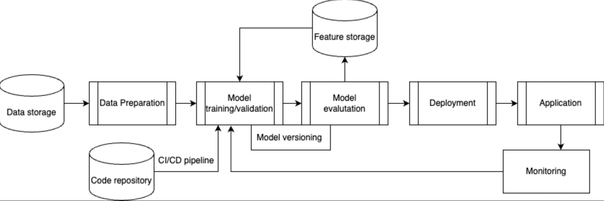

# mlops_homework_itmo
#### 1. Проектирование в соответствии с методологией MLOps

#### 2. Контейнеризация проекта и его билд в гите используя CI
```
docker build -t mlops .
``` 

```
docker run -ti -v $PWD:/mlops mlops bash
```

#### 3. Датасет в ClearML
```
python3 clear_ml/preparation_data_task.py
```


#### 4. Логирование в ClearML
```
python3 clear_ml/train_valid_task.py 
```


#### 5. Пайплайн обучения модели

```
python3 clear_ml/pipeline.py 
```
#### 6. Настройка обновления своей модели на инференсе и создание inference-server

#### 7. Настройка триггеров и мониторинга моделей
```
python3 clear_ml/trigger.py 
```
